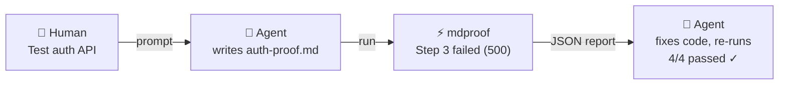
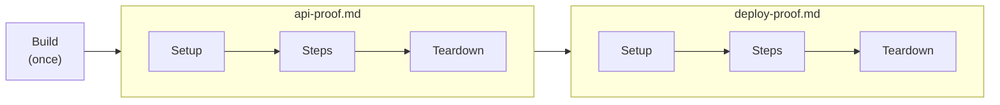

<p align="center">
  
</p>

<p align="center">
  <strong>A test runner built for the AI agent era.</strong><br>
  Write tests as Markdown, run them as real tests.
</p>

> **🚧 This project is under active development. APIs and runbook format may change.**

AI agents already think in Markdown. mdproof makes that the test format — no framework API to learn, no DSL to memorize. An agent reads a runbook, understands the intent, writes new steps, and verifies results. All in the language it already speaks.

```
 ✓ deploy-runbook.md
 ──────────────────────────────────────────────────
 ✓  [setup]
 ✓  Step 1  Install dependencies                142ms
 ✓  Step 2  Build project                       3.2s
 ✓  Step 3  Run migrations                      891ms
 ✓  Step 4  Health check                        204ms
 ✓  [teardown]
 ──────────────────────────────────────────────────
 4/4 passed  4.4s
```

## Why Markdown as Tests?

Traditional test frameworks require learning a language-specific API — `assert.Equal`, `expect().toBe()`, `t.Errorf`. An AI agent can use them, but it's translating intent into framework code, then parsing framework output back into understanding.

mdproof eliminates that translation layer:

````markdown
### Step 1: Create a user

```bash
curl -s -X POST http://localhost:8080/users -d '{"name":"alice"}'
```

Expected:

- jq: .id != null
- jq: .name == "alice"
````

The test IS the documentation. The intent is self-evident. When it fails, the error is immediately meaningful — no stack traces to parse, no test runner abstractions to decode.

### For AI Agents

- **Markdown is native** — LLMs think, read, and write Markdown. No framework API to learn.
- **Self-contained** — each runbook has commands + expected output in one file. An agent can generate a complete test from a single prompt.
- **JSON output** — `mdproof --report json` returns structured results an agent can parse programmatically to decide next steps.
- **Built-in skill** — install `skills/SKILL.md` and your agent instantly knows the full syntax, assertion types, hooks, and best practices.
- **Debuggable** — when a test fails, the agent can read the step, see the output, and fix the runbook or the code. No framework internals to understand.

### For Humans

- **Documentation IS the test** — no separate test files, no context switching.
- **Readable** — anyone can read a runbook and understand what's being tested, even without knowing Go or Python.
- **Lifecycle hooks** — build, setup, teardown for real-world workflows.
- **Container-first** — refuses to execute outside Docker unless explicitly overridden.
- **Persistent sessions** — env vars set in step 1 are available in step 5.
- **Zero dependencies** — pure Go stdlib, single binary.

### How It Fits in an AI Workflow



The agent never left Markdown. It wrote a `.md` file, read a JSON report, and fixed the code. No test framework stood in the way.

### Best for API & CLI Testing

mdproof's sweet spot is testing things that talk through **stdin/stdout** — exactly what bash excels at:

**API testing** — `curl` + `jq:` assertions make HTTP testing trivial. No SDK, no client library, no request builder. The agent writes the same curl commands a human would type:

````markdown
### Step 1: Create resource

```bash
curl -s -X POST http://localhost:8080/items \
  -H "Content-Type: application/json" \
  -d '{"name":"test"}'
```

Expected:

- jq: .id != null
- exit_code: 0
````

**CLI testing** — test any command-line tool by running it and checking output. Build → run → assert, all in Markdown:

````markdown
### Step 1: Build

```bash
go build -o /tmp/myapp ./cmd/myapp
```

### Step 2: Verify help

```bash
/tmp/myapp --help
```

Expected:

- usage
- Should NOT contain panic
````

**Infrastructure / deployment testing** — verify servers start, databases migrate, containers communicate. The persistent session means step 1 can start a service and step 5 can hit its endpoint.

## Install

### From GitHub Releases

```bash
# macOS (Apple Silicon)
curl -fsSL https://github.com/runkids/mdproof/releases/latest/download/mdproof-$(curl -s https://api.github.com/repos/runkids/mdproof/releases/latest | grep tag_name | cut -d'"' -f4)-darwin-arm64.tar.gz | tar xz
sudo mv mdproof-* /usr/local/bin/mdproof

# macOS (Intel)
curl -fsSL https://github.com/runkids/mdproof/releases/latest/download/mdproof-$(curl -s https://api.github.com/repos/runkids/mdproof/releases/latest | grep tag_name | cut -d'"' -f4)-darwin-amd64.tar.gz | tar xz
sudo mv mdproof-* /usr/local/bin/mdproof

# Linux (amd64)
curl -fsSL https://github.com/runkids/mdproof/releases/latest/download/mdproof-$(curl -s https://api.github.com/repos/runkids/mdproof/releases/latest | grep tag_name | cut -d'"' -f4)-linux-amd64.tar.gz | tar xz
sudo mv mdproof-* /usr/local/bin/mdproof

# Linux (arm64)
curl -fsSL https://github.com/runkids/mdproof/releases/latest/download/mdproof-$(curl -s https://api.github.com/repos/runkids/mdproof/releases/latest | grep tag_name | cut -d'"' -f4)-linux-arm64.tar.gz | tar xz
sudo mv mdproof-* /usr/local/bin/mdproof
```

### From Source

```bash
go install github.com/runkids/mdproof/cmd/mdproof@latest
```

### Self-Update

```bash
mdproof upgrade
```

Checks GitHub for the latest release, downloads the correct binary for your platform, and atomically replaces the current executable.

## Quick Start

**1. Write a runbook** (`deploy-proof.md`):

````markdown
# Deploy Verification

## Steps

### Step 1: Check Go version

```bash
go version
```

Expected:

- go1.

### Step 2: Build project

```bash
go build -o /tmp/myapp ./cmd/myapp
```

Expected:

- exit_code: 0

### Step 3: Verify binary

```bash
/tmp/myapp --version
```

Expected:

- regex: v\d+\.\d+\.\d+
````

**2. Run it:**

```bash
# In a devcontainer / Docker:
mdproof deploy-proof.md

# Or override the safety check for local use:
MDPROOF_ALLOW_EXECUTE=1 mdproof deploy-proof.md
```

**3. Dry-run** (parse only, no execution):

```bash
mdproof --dry-run deploy-proof.md
```

## Runbook Format

A runbook is a standard Markdown file. mdproof parses headings, code blocks, and "Expected:" sections to build executable test steps.

### Structure

````markdown
# Runbook Title

## Scope
What this runbook tests (metadata, not executed).

## Environment
Where this runs (metadata, not executed).

## Steps

### Step 1: Do something

Description text (optional, not executed).

```bash
echo "hello world"
```

Expected:

- hello world

## Pass Criteria
Anything after this heading is ignored by the parser.
````

### Step Headings

Steps are identified by `##` or `###` headings with a number:

```markdown
## Step 0: Setup environment
### Step 1: Install dependencies
### 2. Build the project
### 3b. Run secondary checks
```

### Code Blocks

Fenced code blocks with `bash` or `sh` (or no language) are automatically executed. Other languages are marked as manual and skipped:

````markdown
```bash
make build        # ← auto-executed
```

```python
print("hello")    # ← skipped (manual)
```
````

Multiple code blocks within a single step are joined and executed together. Heredocs with embedded code fences are handled correctly.

### Assertions

The `Expected:` section defines assertions as a bullet list. Five types are supported, and all can be mixed freely:

#### Substring (default)

Case-insensitive substring match against combined stdout+stderr:

```markdown
Expected:

- hello world
- build succeeded
```

#### Negated Substring

Passes when the pattern is NOT found. Recognized prefixes: `No`, `not`, `NOT`, `Should NOT`, `Must NOT`, `Does not`:

```markdown
Expected:

- No error
- Should NOT contain warning
- not deprecated
```

#### Exit Code

Matches the command's exit code. Prefix with `!` to negate:

```markdown
Expected:

- exit_code: 0
- exit_code: !1
```

#### Regex

Go regex pattern. `(?m)` is auto-prepended so `^`/`$` match line boundaries:

```markdown
Expected:

- regex: version \d+\.\d+\.\d+
- regex: ^BUILD SUCCESS$
```

#### jq

JSON query against stdout only. Passes if `jq -e <expr>` exits 0 (requires `jq` installed):

```markdown
Expected:

- jq: .status == "ok"
- jq: .items | length > 0
```

#### Snapshot

Captures stdout and compares against a stored `.snap` file. On first run, the snapshot is created automatically. On subsequent runs, mismatches fail the step:

```markdown
Expected:

- snapshot: api-response
```

Snapshots are stored in `__snapshots__/<runbook-name>.snap` relative to the runbook file. To update snapshots after intentional output changes:

```bash
mdproof --update-snapshots test-proof.md
mdproof -u test-proof.md  # shorthand
```

Each snapshot name must be unique within a runbook. Multiple snapshot assertions in different steps share the same `.snap` file.

**No assertions = exit code decides**: if no Expected section is present, exit code 0 = pass, non-zero = fail.

**Assertions override exit code**: if assertions are present, they determine the final status regardless of exit code.

### Directives

#### Inline Timeout

```markdown
### Step 5: Slow operation (timeout: 10m)
```

#### HTML Comment Directives

```markdown
### Step 3: Flaky network call

<!-- runbook: timeout=30s retry=3 delay=5s -->
```

```markdown
### Step 4: Depends on build

<!-- runbook: depends=2 -->
```

| Directive | Description |
|-----------|-------------|
| `timeout=Xs` | Per-step timeout override |
| `retry=N` | Retry up to N times on failure |
| `delay=Xs` | Wait between retries |
| `depends=N` | Skip if step N failed |

### Optional Sections

Content under `## Optional: ...` headings is skipped entirely by the parser.

### Inline Testing

Test code examples embedded in any Markdown file — READMEs, API docs, tutorials. Wrap testable blocks with HTML comment markers:

````markdown
# My API Documentation

Install the SDK:

```bash
npm install my-sdk
```

<!-- mdproof:start -->
```bash
curl -s http://localhost:8080/health
```

Expected:

- exit_code: 0
- jq: .status == "ok"
<!-- mdproof:end -->

More documentation continues here...
````

Run with the `--inline` flag:

```bash
mdproof --inline README.md
mdproof --inline ./docs/  # scans all .md files in directory
```

Key differences from regular runbooks:
- Steps are delimited by `<!-- mdproof:start -->` / `<!-- mdproof:end -->` instead of step headings
- Steps are auto-numbered (1, 2, 3...)
- The `# heading` becomes the runbook title
- Nested markers and unclosed markers produce errors
- All assertion types work inside inline blocks, including snapshots

### Coverage

Analyze assertion coverage of your runbooks without executing them:

```bash
mdproof --coverage ./runbooks/
```

```
 mdproof coverage report
 ─────────────────────────────────────────────────────────────────
 File                           Steps  Covered  Assertions  Score
 ─────────────────────────────────────────────────────────────────
 deploy-proof.md                    5        4          12    80%
 api-proof.md                       8        8          15   100%
 ─────────────────────────────────────────────────────────────────
 Total                             13       12          27    92%

 ! deploy-proof.md: Step 3 have no assertions
```

Set a minimum threshold for CI:

```bash
mdproof --coverage --coverage-min 80 ./runbooks/
# Exits 1 if total score < 80%
```

Coverage is pure static analysis — it counts steps with assertions vs. steps without. Manual steps (non-bash) are excluded. A warning is shown when all assertions are substring-only (low diversity).

### Watch Mode

Re-run tests automatically when files change:

```bash
mdproof --watch ./runbooks/
mdproof --watch --inline ./docs/
```

Watch mode:
- Polls files every 500ms using `os.Stat`
- Re-scans the directory for new files on each poll
- Automatically sets `MDPROOF_ALLOW_EXECUTE=1` (watch implies local development)
- Runs all matching files on startup, then only changed files on subsequent runs
- Exit with `Ctrl+C`

```
mdproof dev — watching 3 file(s)

 ✓ api-proof.md
 ...

Watching for changes... (Ctrl+C to quit)

--- 1 file(s) changed ---

 ✓ api-proof.md
 ...

Watching for changes... (Ctrl+C to quit)
```

## Hooks

mdproof provides three lifecycle hooks for setting up and tearing down test environments. Hooks can be configured via CLI flags or `mdproof.json`.

### Build Hook

Runs **once before all runbooks**. Use for compiling binaries, pulling images, or one-time setup. If the build hook fails, mdproof aborts immediately — no runbooks are executed.

```bash
mdproof --build "make build" ./runbooks/
```

```
  Build: running...
  Build: passed (2.3s)

 ✓ integration-proof.md
 ...
```

### Setup Hook

Runs **before each runbook**. Use for starting services, seeding databases, or creating temp directories. If setup fails, all steps in that runbook are marked as skipped.

```bash
mdproof --setup "docker-compose up -d && sleep 2" ./runbooks/
```

```
 ✓ api-proof.md
 ──────────────────────────────────────────────────
 ✓  [setup]
 ✓  Step 1  Health check                        204ms
 ✓  Step 2  Create user                         312ms
 ──────────────────────────────────────────────────
 2/2 passed  516ms
```

### Teardown Hook

Runs **after each runbook**, regardless of pass/fail. Use for cleanup — stopping containers, dropping databases, removing temp files. Teardown failures are informational only (they don't affect the final result).

```bash
mdproof --teardown "docker-compose down" ./runbooks/
```

### Combining All Hooks

```bash
mdproof \
  --build "make build" \
  --setup "docker-compose up -d && make seed" \
  --teardown "docker-compose down -v" \
  ./runbooks/
```

Or in `mdproof.json` for persistent configuration:

```json
{
  "build": "make build",
  "setup": "docker-compose up -d && make seed",
  "teardown": "docker-compose down -v",
  "timeout": "5m",
  "env": {
    "DATABASE_URL": "postgres://localhost:5432/test",
    "LOG_LEVEL": "debug"
  }
}
```

### Hook Execution Model



| Hook | Scope | On Failure |
|------|-------|------------|
| `build` | Once, before all runbooks | Abort — nothing runs |
| `setup` | Per runbook, before steps | All steps skipped |
| `teardown` | Per runbook, after steps | Informational only |

Setup and teardown run inside the same bash session as the steps, so they share environment variables. Build runs as a separate process.

## Configuration

Create `mdproof.json` in the runbook directory:

```json
{
  "build": "make build",
  "setup": "docker-compose up -d",
  "teardown": "docker-compose down",
  "timeout": "5m",
  "strict": false,
  "env": {
    "LOG_LEVEL": "debug",
    "API_URL": "http://localhost:8080"
  }
}
```

| Field | Type | Description |
|-------|------|-------------|
| `build` | string | Command to run once before all runbooks |
| `setup` | string | Command to run before each runbook |
| `teardown` | string | Command to run after each runbook |
| `timeout` | string | Default per-step timeout (e.g. `"2m"`, `"30s"`) |
| `strict` | boolean | Container-only execution (default: `true`) |
| `env` | object | Environment variables seeded into all steps |

CLI flags override config file values.

## CLI Reference

```
mdproof [flags] <file.md|directory>
```

When given a directory, mdproof finds files matching `*_runbook.md`, `*-runbook.md`, `*_proof.md`, or `*-proof.md`.

### Flags

| Flag | Description |
|------|-------------|
| `--dry-run` | Parse and classify only, don't execute |
| `--version` | Print version and exit |
| `--report json` | Output as JSON |
| `--output FILE`, `-o FILE` | Write JSON report to file |
| `--timeout DURATION` | Per-step timeout (default: 2m) |
| `--build CMD` | Build hook: run once before all runbooks |
| `--setup CMD` | Setup hook: run before each runbook |
| `--teardown CMD` | Teardown hook: run after each runbook |
| `--fail-fast` | Stop after first failed step |
| `--strict` | Container-only execution (default: true, use `--strict=false` to allow local) |
| `--steps 1,3,5` | Only run specific steps |
| `--from N` | Run from step N onwards |
| `--update-snapshots`, `-u` | Update snapshot files instead of comparing |
| `--inline` | Parse inline test blocks from any `.md` file |
| `--coverage` | Show coverage report (no execution) |
| `--coverage-min N` | Minimum coverage score (exit 1 if below) |
| `--watch` | Watch for file changes and re-run |
| `-v` | Show assertion details |
| `-vv` | Show assertions + stdout/stderr |

### Subcommands

| Command | Description |
|---------|-------------|
| `sandbox [flags] <file\|dir>` | Auto-provision a container and run inside it |
| `upgrade` | Self-update to the latest release |

#### Sandbox Mode

Auto-provision a Docker (or Apple) container, cross-compile mdproof for the target platform, detect dependencies from runbook code blocks, and execute inside the container — all in one command:

```bash
mdproof sandbox tests/
mdproof sandbox --image node:20 api-proof.md
mdproof sandbox --keep --ro tests/   # keep container, read-only mount
```

| Flag | Description |
|------|-------------|
| `--image IMAGE` | Container image (default: `debian:bookworm-slim`) |
| `--keep` | Don't auto-remove container after exit |
| `--ro` | Mount workspace read-only |

Sandbox settings can also be configured in `mdproof.json`:

```json
{
  "sandbox": {
    "image": "node:20",
    "keep": false,
    "ro": false
  }
}
```

Runtime detection: prefers Apple containers on macOS arm64 (if available), falls back to Docker. Override with `MDPROOF_RUNTIME=docker` or `MDPROOF_RUNTIME=apple`.

### Examples

```bash
# Auto-provision a container and run
mdproof sandbox deploy-proof.md

# Run a single runbook
mdproof deploy-proof.md

# Run all runbooks in a directory
mdproof ./runbooks/

# Dry-run to validate syntax
mdproof --dry-run deploy-proof.md

# Run with verbose output showing assertions
mdproof -v deploy-proof.md

# Extra verbose: assertions + stdout/stderr
mdproof -v -v deploy-proof.md

# Run specific steps only
mdproof --steps 1,3 deploy-proof.md

# Run from step 5 onwards
mdproof --from 5 deploy-proof.md

# Fail fast and output JSON
mdproof --fail-fast --report json deploy-proof.md

# Save JSON report to file
mdproof -o results.json deploy-proof.md

# Full lifecycle: build → setup → steps → teardown
mdproof \
  --build "make build" \
  --setup "make seed" \
  --teardown "make clean" \
  deploy-proof.md

# Update snapshots after intentional changes
mdproof -u deploy-proof.md

# Coverage report
mdproof --coverage ./runbooks/

# Coverage gate in CI
mdproof --coverage --coverage-min 80 ./runbooks/

# Test inline code examples in docs
mdproof --inline README.md

# Watch mode for development
mdproof --watch deploy-proof.md
```

## How It Works

### Container Safety (Strict Mode)

mdproof runs in **strict mode** by default — it refuses to execute outside containers. This protects against accidentally running destructive commands on your host machine.

To detect a container, it checks for:

1. `/.dockerenv` file (Docker)
2. `/run/.containerenv` file (Podman)
3. `MDPROOF_ALLOW_EXECUTE=1` environment variable

To run locally, use sandbox mode or disable strict mode:

```bash
# Sandbox: auto-provision a container (recommended)
mdproof sandbox deploy-proof.md

# CLI flag
mdproof --strict=false deploy-proof.md

# Config file (mdproof.json)
{ "strict": false }

# Environment variable
MDPROOF_ALLOW_EXECUTE=1 mdproof deploy-proof.md
```

Priority: CLI `--strict` flag > `mdproof.json` > environment variable > container detection.

### Persistent Shell Session

All steps within a runbook share a single bash process. Each step runs in a subshell with `set -o pipefail`, but exported variables persist via an env file that's sourced before each step:

````markdown
### Step 1: Set variable

```bash
export APP_PORT=8080
```

### Step 2: Use variable

```bash
echo "Running on port $APP_PORT"
```

Expected:

- 8080
````

### Step Classification

| Code Block Language | Classification | Behavior |
|-------------------|----------------|----------|
| `bash`, `sh`, or none | auto | Executed in session |
| Any other language | manual | Skipped |
| No code block | manual | Skipped |

### Assertion Logic

- **With assertions**: assertions determine pass/fail, regardless of exit code
- **Without assertions**: exit code alone determines pass/fail (0 = pass)
- Substring and regex match against combined stdout + stderr
- jq matches against stdout only

## AI Agent Skill

mdproof ships with a built-in skill (`skills/SKILL.md`) that teaches AI coding agents how to write and run mdproof tests. Install it once, and your AI agent (Claude Code, Codex, etc.) will know the full runbook syntax, assertion types, hooks, CLI flags, and best practices.

### Install the Skill

**Claude Code** (via [skillshare](https://github.com/runkids/skillshare)):

```bash
skillshare install runkids/mdproof
```

**Manual**: copy `skills/SKILL.md` into your project's `.claude/skills/` or agent's skill directory.

### What the Agent Learns

Once installed, your AI agent can autonomously:

- Write runbook files with correct naming (`*-proof.md`, `*_runbook.md`)
- Use all 5 assertion types (substring, exit_code, regex, jq, snapshot)
- Configure hooks (build, setup, teardown) and `mdproof.json`
- Apply directives (timeout, retry, depends)
- Handle container safety (`MDPROOF_ALLOW_EXECUTE=1`)
- Run with the right flags and interpret results

### Example Interaction

```
User: "Write a smoke test for our API"

Agent: [uses mdproof skill]
  → Creates api-proof.md with health check, CRUD, and error handling steps
  → Configures setup/teardown hooks for docker-compose
  → Runs: MDPROOF_ALLOW_EXECUTE=1 mdproof api-proof.md
  → Reports: 5/5 passed
```

```
User: "The deploy script sometimes fails on step 3, add a retry"

Agent: [uses mdproof skill]
  → Adds <!-- runbook: retry=3 delay=10s --> to step 3
  → Re-runs the runbook to verify
```

## CI Integration

mdproof works in any CI environment. Set `MDPROOF_ALLOW_EXECUTE=1` to run outside containers:

```yaml
# GitHub Actions
- name: Run runbook tests
  env:
    MDPROOF_ALLOW_EXECUTE: "1"
  run: mdproof --fail-fast -o results.json ./runbooks/

- name: Upload test report
  if: always()
  uses: actions/upload-artifact@v4
  with:
    name: mdproof-results
    path: results.json
```

## Architecture

```
cmd/mdproof/main.go        CLI entry point (flag parsing, hooks, reporting)
mdproof.go                  Public API facade (type aliases + function wrappers)
internal/
  core/types.go             Shared types (Step, Report, Summary, AssertionResult)
  parser/parser.go          Markdown parser + step classifier
  parser/inline.go          Inline test block parser (<!-- mdproof:start/end -->)
  executor/session.go       Bash session executor (single process, env persistence)
  assertion/assertion.go    Assertion engine (substring, regex, exit_code, jq, snapshot)
  snapshot/snapshot.go      Snapshot store (.snap file management)
  coverage/coverage.go      Static coverage analysis engine
  config/config.go          Config loader (mdproof.json) + CLI merge
  runner/runner.go          Orchestrator (parse → classify → hooks → execute → assert)
  report/                   JSON + plain text + coverage reporters
  watcher/watcher.go        File change detector (os.Stat polling)
  upgrade/upgrade.go        Self-update from GitHub releases
  sandbox/                  Auto-container provisioning (cross-compile + runtime detection)
.skillshare/skills/         AI agent skills (e2e-test, implement, devcontainer, changelog)
```

Zero external dependencies. Pure Go stdlib.

## License

MIT
