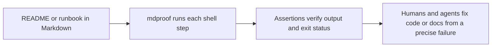

<p align="center">
  
</p>

<h3 align="center">Turn Markdown into executable tests.</h3>

<p align="center">
  <strong>mdproof</strong> runs the commands in your docs, runbooks, and smoke tests, then verifies the result with assertions.<br>
  Use one <code>.md</code> file for documentation, operational steps, and CI checks.
</p>

<p align="center">
  Best for <strong>README example verification</strong>, <strong>CLI and API smoke tests</strong>, <strong>deploy runbooks</strong>, and <strong>agent-generated workflows</strong>.
</p>

<p align="center">
  <a href="https://github.com/runkids/mdproof/actions/workflows/ci.yml"></a>
  <a href="https://github.com/runkids/mdproof/releases"></a>
  
  <a href="LICENSE"></a>
</p>

<p align="center"><em>⚠️ Under active development — APIs and runbook format may change.</em></p>

---

<p align="center">
  
</p>

## What mdproof does

`mdproof` executes shell steps from a Markdown file and checks the output with assertions like `exit_code`, `jq`, substring matching, regex, and snapshots.

That makes Markdown useful for more than prose:

- Your README examples can become runnable checks.
- Your deploy runbooks can become executable verification steps.
- Your smoke tests can stay readable by humans and writable by agents.

Instead of splitting documentation and tests across different formats, `mdproof` keeps them in one place.

````markdown
### Step 1: Create a user

```bash
curl -s -X POST http://localhost:8080/users -d '{"name":"alice"}'
```

Expected:

- jq: .id != null
- jq: .name == "alice"
````

The test is the documentation. When it fails, the error points to the exact step and expectation that broke.



## Why teams use it

- **Docs stop drifting**: examples in `README.md` or `docs/*.md` can be verified in CI.
- **Runbooks become safer**: the same file an operator reads can be executed during deploy verification.
- **Agents fit naturally**: agents already write Markdown well, so they can generate or repair tests without learning a test framework API.
- **Review stays simple**: a Markdown diff is easier to inspect than a custom test harness for many workflow-style checks.
- **Failures are traceable**: mdproof reports the Markdown file and line that failed, so humans and agents can jump straight to the broken step.

## Quick Start

**1. Install:**

```bash
curl -fsSL https://raw.githubusercontent.com/runkids/mdproof/main/install.sh | sh
```

**2. Write a test** (`api-proof.md`):

````markdown
# API Smoke Test

## Steps

### Step 1: Health check

```bash
curl -sf http://localhost:8080/health
```

Expected:

- exit_code: 0
- jq: .status == "ok"

### Step 2: Create item

```bash
curl -s -X POST http://localhost:8080/items \
  -H "Content-Type: application/json" \
  -d '{"name":"test"}'
```

Expected:

- jq: .id != null
- jq: .name == "test"
````

**3. Run it:**

```bash
mdproof sandbox api-proof.md     # auto-provisions a container
```

```
 ✓ api-proof.md
 ──────────────────────────────────────────────────
 ✓  Step 1  Health check                           52ms
 ✓  Step 2  Create item                            18ms
 ──────────────────────────────────────────────────
 2/2 passed  80ms
```

When a check fails, mdproof reports where it came from:

```text
 ✗ source-aware-assert-proof.md
 ──────────────────────────────────────────────────
 ✗  Step 1  Assertion failure                      1ms
          FAIL runbooks/fixtures/source-aware-assert-proof.md:13 Step 1: Assertion failure
          Assertion runbooks/fixtures/source-aware-assert-proof.md:13 expected output
          └─ expected: expected output
 ──────────────────────────────────────────────────
 0/1 passed  1 failed  1ms
```

## Use Cases

| Use Case | How |
|----------|-----|
| **AI agent test loop** | Agent writes `.md` → mdproof runs → JSON report → agent fixes code → re-run. Never leaves Markdown. |
| **CLI tool E2E testing** | Build → run → assert output. Especially good for Go/Rust single-binary CLIs. |
| **API smoke testing** | `curl` + `jq:` assertions. No Postman, no SDK. The test IS the docs. |
| **Deployment verification** | Post-deploy runbook: health checks, DB migration, service connectivity. Ops can read it, CI can run it. |
| **README code verification** | `--inline` mode ensures code examples in docs never go stale. |

**Not a fit for**: unit tests (use `go test`/`pytest`), browser UI (Playwright), perf benchmarks, or complex programmatic fixtures.

## Features

<table>
<tr>
<td width="50%">

**For AI Agents**
- Markdown is native — no framework API to learn
- Self-contained — one file = commands + assertions
- JSON / JUnit XML output — `--report json` or `--report junit` for programmatic parsing
- Built-in skill — `skills/SKILL.md` teaches your agent the full syntax
- Debuggable — agent reads step, sees output, fixes it

</td>
<td width="50%">

**For Humans**
- Documentation IS the test — no context switching
- Readable — anyone can understand what's being tested
- Lifecycle hooks — `--build`, `--setup`/`--teardown`, `-step-setup`/`-step-teardown`
- Container-first — safe by default, sandbox mode
- Persistent sessions — env vars flow across steps and `---` sub-commands
- Per-runbook isolation — `--isolation per-runbook` for clean `$HOME`/`$TMPDIR`
- Step filtering — `--steps 1,3`, `--from N`, `--fail-fast`
- Coverage — `--coverage` for CI gating
- Inline testing — `--inline` validates code examples in any `.md`
- Zero dependencies — pure Go stdlib, single binary

</td>
</tr>
</table>

## Install

### macOS / Linux

```bash
curl -fsSL https://raw.githubusercontent.com/runkids/mdproof/main/install.sh | sh
```

### Windows (PowerShell)

```powershell
irm https://raw.githubusercontent.com/runkids/mdproof/main/install.ps1 | iex
```

### Homebrew

```bash
brew install runkids/tap/mdproof
```

> **Tip:** Run `mdproof upgrade` to update to the latest version. It auto-detects your platform and handles the rest.

### From Source

```bash
go install github.com/runkids/mdproof/cmd/mdproof@latest
```

## Runbook Format

A runbook is a standard Markdown file with step headings, bash code blocks, and `Expected:` assertions.

````markdown
# Deploy Verification

## Steps

### Step 1: Check health

```bash
curl -sf http://localhost:8080/health
```

Expected:

- exit_code: 0
- jq: .status == "ok"

### Step 2: Create resource

```bash
curl -s -X POST http://localhost:8080/items \
  -d '{"name":"test"}'
```

Expected:

- jq: .id != null
- Should NOT contain error
````

### Assertions

| Type | Syntax | Example |
|------|--------|---------|
| Substring | plain text | `- hello world` |
| Negated | `No`/`Should NOT` prefix | `- Should NOT contain error` |
| Exit code | `exit_code: N` | `- exit_code: 0` |
| Regex | `regex:` prefix | `- regex: v\d+\.\d+` |
| jq | `jq:` prefix | `- jq: .status == "ok"` |
| Snapshot | `snapshot:` prefix | `- snapshot: api-response` |

No `Expected:` section → exit code decides (0 = pass).

### Key Concepts

- **Persistent session** — all steps share one bash process; `export` vars persist across steps and `---` sub-commands
- **Container-first** — strict mode (default) refuses to run outside containers; use `mdproof sandbox` or `--strict=false`
- **Hooks** — `--build` (once), `--setup` / `--teardown` (per runbook), `-step-setup` / `-step-teardown` (per step)
- **Directives** — `<!-- runbook: timeout=30s retry=3 depends=2 -->` for per-step control
- **Sub-commands** — `---` separator splits a code block into independent subshells with shared env
- **Isolation** — `--isolation per-runbook` gives each runbook a fresh `$HOME` and `$TMPDIR`
- **Step filtering** — `--steps 1,3,5` or `--from N` to run a subset; `--fail-fast` to stop early
- **Coverage** — `--coverage` reports assertion coverage; `--coverage-min N` for CI gating
- **Inline testing** — `--inline` extracts `<!-- mdproof:start/end -->` blocks from any `.md`
- **Source-aware failures** — failed assertions, command exits, and parser errors point back to Markdown file + line
- **Snapshots** — `snapshot:` assertions with `-u` to update

## Documentation

| | |
|---|---|
| **[Writing Runbooks](docs/writing-runbooks.md)** | Full assertion reference, directives, inline testing, persistent sessions, source tracking |
| **[CLI Reference](docs/cli-reference.md)** | All flags, subcommands, sandbox mode, usage examples, failure output |
| **[Advanced Features](docs/advanced.md)** | Hooks, configuration, reports, coverage, CI integration, architecture |

## AI Agent Skill

mdproof ships with `skills/SKILL.md` — install it once, and your AI agent knows the full syntax.

```bash
# Claude Code (via https://github.com/runkids/skillshare)
skillshare install runkids/mdproof

# Manual: copy skills/SKILL.md to your agent's skill directory
```

## License

MIT
