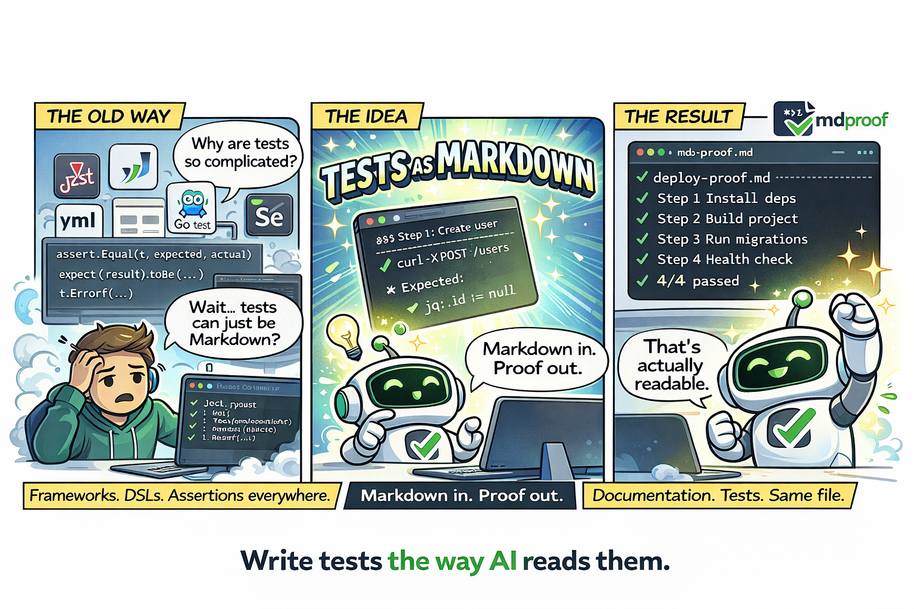
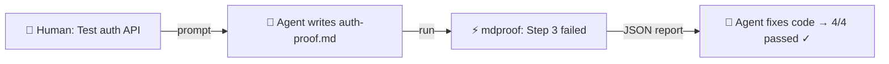

<p align="center">
  
</p>

<h3 align="center">The testing framework for the AI agent era.</h3>

<p align="center">
  Today's tests are written for humans. Tomorrow's tests will be written by agents.<br>
  <strong>mdproof: Write tests as Markdown. Run them as real tests.</strong>
</p>

<p align="center">
  <a href="https://github.com/runkids/mdproof/actions/workflows/ci.yml"></a>
  <a href="https://github.com/runkids/mdproof/releases"></a>
  
  <a href="LICENSE"></a>
</p>

<p align="center"><em>⚠️ Under active development — APIs and runbook format may change.</em></p>

---

<p align="center">
  
</p>

## Why Markdown?

AI agents think in Markdown. They read it, write it, and reason about it natively. Traditional test frameworks (`assert.Equal`, `expect().toBe()`) force agents to translate intent into framework code, then parse framework output back into understanding.

**mdproof eliminates that translation layer.**

````markdown
### Step 1: Create a user

```bash
curl -s -X POST http://localhost:8080/users -d '{"name":"alice"}'
```

Expected:

- jq: .id != null
- jq: .name == "alice"
````

The test IS the documentation. When it fails, the error is immediately meaningful — no stack traces, no abstractions.



## Quick Start

**1. Install:**

```bash
curl -fsSL https://raw.githubusercontent.com/runkids/mdproof/main/install.sh | sh
```

**2. Write a test** (`api-proof.md`):

````markdown
# API Smoke Test

## Steps

### Step 1: Health check

```bash
curl -sf http://localhost:8080/health
```

Expected:

- exit_code: 0
- jq: .status == "ok"

### Step 2: Create item

```bash
curl -s -X POST http://localhost:8080/items \
  -H "Content-Type: application/json" \
  -d '{"name":"test"}'
```

Expected:

- jq: .id != null
- jq: .name == "test"
````

**3. Run it:**

```bash
mdproof sandbox api-proof.md     # auto-provisions a container
```

```
 ✓ api-proof.md
 ──────────────────────────────────────────────────
 ✓  Step 1  Health check                           52ms
 ✓  Step 2  Create item                            18ms
 ──────────────────────────────────────────────────
 2/2 passed  80ms
```

## Use Cases

| Use Case | How |
|----------|-----|
| **AI agent test loop** | Agent writes `.md` → mdproof runs → JSON report → agent fixes code → re-run. Never leaves Markdown. |
| **CLI tool E2E testing** | Build → run → assert output. Especially good for Go/Rust single-binary CLIs. |
| **API smoke testing** | `curl` + `jq:` assertions. No Postman, no SDK. The test IS the docs. |
| **Deployment verification** | Post-deploy runbook: health checks, DB migration, service connectivity. Ops can read it, CI can run it. |
| **README code verification** | `--inline` mode ensures code examples in docs never go stale. |

**Not a fit for**: unit tests (use `go test`/`pytest`), browser UI (Playwright), perf benchmarks, or complex programmatic fixtures.

## Features

<table>
<tr>
<td width="50%">

**For AI Agents**
- Markdown is native — no framework API to learn
- Self-contained — one file = commands + assertions
- JSON output — `--report json` for programmatic parsing
- Built-in skill — `skills/SKILL.md` teaches your agent the full syntax
- Debuggable — agent reads step, sees output, fixes it

</td>
<td width="50%">

**For Humans**
- Documentation IS the test — no context switching
- Readable — anyone can understand what's being tested
- Lifecycle hooks — build, setup, teardown
- Container-first — safe by default, sandbox mode
- Persistent sessions — env vars flow across steps
- Zero dependencies — pure Go stdlib, single binary

</td>
</tr>
</table>

## Install

### macOS / Linux

```bash
curl -fsSL https://raw.githubusercontent.com/runkids/mdproof/main/install.sh | sh
```

### Windows (PowerShell)

```powershell
irm https://raw.githubusercontent.com/runkids/mdproof/main/install.ps1 | iex
```

### Homebrew

```bash
brew install runkids/tap/mdproof
```

> **Tip:** Run `mdproof upgrade` to update to the latest version. It auto-detects your platform and handles the rest.

### From Source

```bash
go install github.com/runkids/mdproof/cmd/mdproof@latest
```

## Runbook Format

A runbook is a standard Markdown file with step headings, bash code blocks, and `Expected:` assertions.

````markdown
# Deploy Verification

## Steps

### Step 1: Check health

```bash
curl -sf http://localhost:8080/health
```

Expected:

- exit_code: 0
- jq: .status == "ok"

### Step 2: Create resource

```bash
curl -s -X POST http://localhost:8080/items \
  -d '{"name":"test"}'
```

Expected:

- jq: .id != null
- Should NOT contain error
````

### Assertions

| Type | Syntax | Example |
|------|--------|---------|
| Substring | plain text | `- hello world` |
| Negated | `No`/`Should NOT` prefix | `- Should NOT contain error` |
| Exit code | `exit_code: N` | `- exit_code: 0` |
| Regex | `regex:` prefix | `- regex: v\d+\.\d+` |
| jq | `jq:` prefix | `- jq: .status == "ok"` |
| Snapshot | `snapshot:` prefix | `- snapshot: api-response` |

No `Expected:` section → exit code decides (0 = pass).

### Key Concepts

- **Persistent session** — all steps share one bash process; `export` vars persist across steps
- **Container-first** — strict mode (default) refuses to run outside containers; use `mdproof sandbox` or `--strict=false`
- **Hooks** — `--build` (once), `--setup` / `--teardown` (per runbook) for lifecycle management
- **Directives** — `<!-- runbook: timeout=30s retry=3 -->` for per-step control

## Documentation

| | |
|---|---|
| **[Writing Runbooks](docs/writing-runbooks.md)** | Full assertion reference, directives, inline testing, persistent sessions |
| **[CLI Reference](docs/cli-reference.md)** | All flags, subcommands, sandbox mode, usage examples |
| **[Advanced Features](docs/advanced.md)** | Hooks, configuration, coverage, watch mode, CI integration, architecture |

## AI Agent Skill

mdproof ships with `skills/SKILL.md` — install it once, and your AI agent knows the full syntax.

```bash
# Claude Code (via https://github.com/runkids/skillshare)
skillshare install runkids/mdproof

# Manual: copy skills/SKILL.md to your agent's skill directory
```

## License

MIT
