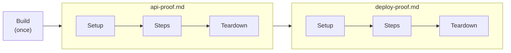

# Advanced Features

## Hooks

mdproof provides three lifecycle hooks for setting up and tearing down test environments. Hooks can be configured via CLI flags or `mdproof.json`.

### Build Hook

Runs **once before all runbooks**. Use for compiling binaries, pulling images, or one-time setup. If the build hook fails, mdproof aborts immediately — no runbooks are executed.

```bash
mdproof --build "make build" ./runbooks/
```

```
  Build: running...
  Build: passed (2.3s)

 ✓ integration-proof.md
 ...
```

### Setup Hook

Runs **before each runbook**. Use for starting services, seeding databases, or creating temp directories. If setup fails, all steps in that runbook are marked as skipped.

```bash
mdproof --setup "docker-compose up -d && sleep 2" ./runbooks/
```

```
 ✓ api-proof.md
 ──────────────────────────────────────────────────
 ✓  [setup]
 ✓  Step 1  Health check                        204ms
 ✓  Step 2  Create user                         312ms
 ──────────────────────────────────────────────────
 2/2 passed  516ms
```

### Teardown Hook

Runs **after each runbook**, regardless of pass/fail. Use for cleanup — stopping containers, dropping databases, removing temp files. Teardown failures are informational only (they don't affect the final result).

```bash
mdproof --teardown "docker-compose down" ./runbooks/
```

### Combining All Hooks

```bash
mdproof \
  --build "make build" \
  --setup "docker-compose up -d && make seed" \
  --teardown "docker-compose down -v" \
  ./runbooks/
```

### Hook Execution Model



| Hook | Scope | On Failure |
|------|-------|------------|
| `build` | Once, before all runbooks | Abort — nothing runs |
| `setup` | Per runbook, before steps | All steps skipped |
| `teardown` | Per runbook, after steps | Informational only |
| `step-setup` | Per step, before step body | Step marked failed, body skipped |
| `step-teardown` | Per step, after step body | Informational only |

Setup and teardown run inside the same bash session as the steps, so they share environment variables. Build runs as a separate process.

### Per-Step Setup/Teardown

Distinct from per-runbook hooks, these run before/after **each step**:

```bash
mdproof -step-setup 'rm -rf /tmp/test-state && mkdir -p /tmp/test-state' test.md
mdproof -step-teardown 'echo step done' test.md
mdproof -step-setup 'reset-db' -step-teardown 'dump-logs' test.md
```

- Step-setup stdout is **not** mixed into step stdout
- JSON report includes `step_setup` and `step_teardown` objects with `exit_code`, `stdout`, `stderr`
- When neither flag is provided, no `step_setup`/`step_teardown` fields appear in the report
- With retry (`<!-- runbook: retry=N -->`), each attempt runs the full cycle: setup → body → teardown

## Configuration

Create `mdproof.json` in the runbook directory:

```json
{
  "build": "make build",
  "setup": "docker-compose up -d",
  "teardown": "docker-compose down",
  "step_setup": "rm -rf /tmp/test-state",
  "step_teardown": "echo step done",
  "timeout": "5m",
  "strict": false,
  "isolation": "per-runbook",
  "env": {
    "LOG_LEVEL": "debug",
    "API_URL": "http://localhost:8080"
  }
}
```

| Field | Type | Description |
|-------|------|-------------|
| `build` | string | Command to run once before all runbooks |
| `setup` | string | Command to run before each runbook |
| `teardown` | string | Command to run after each runbook |
| `step_setup` | string | Command to run before each step |
| `step_teardown` | string | Command to run after each step |
| `timeout` | string | Default per-step timeout (e.g. `"2m"`, `"30s"`) |
| `strict` | boolean | Container-only execution (default: `true`) |
| `isolation` | string | `"shared"` (default) or `"per-runbook"` |
| `env` | object | Environment variables seeded into all steps |

Sandbox settings can also be configured:

```json
{
  "sandbox": {
    "image": "node:20",
    "keep": false,
    "ro": false
  }
}
```

CLI flags override config file values.

## Per-Runbook Isolation

By default, all runbooks share the host's `$HOME` and `$TMPDIR`. With `--isolation per-runbook`, each runbook gets a fresh temp directory as `$HOME` with `$TMPDIR` under `$HOME/tmp`, cleaned up after each runbook:

```bash
mdproof --isolation per-runbook ./runbooks/
```

Or in `mdproof.json`:

```json
{ "isolation": "per-runbook" }
```

- Build hook (`--build`) runs in the original environment — not affected by isolation
- Setup/teardown hooks inherit the isolated `$HOME`/`$TMPDIR`
- Invalid values produce an error at config load time
- CLI `--isolation` overrides the config file value

## Report Formats

### JSON

```bash
mdproof --report json test.md          # single object to stdout
mdproof --report json ./runbooks/      # JSON array to stdout
mdproof -o results.json ./runbooks/    # always writes JSON array to file
```

Single-file mode outputs one JSON object; directory mode outputs a JSON array.

Each step also includes source metadata:

```json
{
  "steps": [
    {
      "source": {
        "heading": { "start": { "line": 5 }, "end": { "line": 5 } },
        "code_blocks": [
          { "start": { "line": 7 }, "end": { "line": 9 } }
        ]
      },
      "assertions": [
        {
          "pattern": "expected output",
          "matched": false,
          "source": { "start": { "line": 13 }, "end": { "line": 13 } }
        }
      ]
    }
  ]
}
```

This makes JSON reports easier to consume from CI tooling and agent repair loops.

### JUnit XML

```bash
mdproof --report junit ./runbooks/              # stdout
mdproof --report junit -o results.xml ./runbooks/  # file
```

Produces JUnit XML for native CI test result display (GitHub Actions, GitLab CI, Jenkins). Failure bodies start with a `Location: path:line` line when source information is available. Sub-command exit codes and stderr are also included in failure bodies.

### Plain Text Failures

Default output now points to the Markdown source that failed:

```text
FAIL runbooks/fixtures/source-aware-assert-proof.md:13 Step 1: Assertion failure
Assertion runbooks/fixtures/source-aware-assert-proof.md:13 expected output
Command runbooks/fixtures/source-aware-exit-proof.md:7-10
```

## Coverage

Analyze assertion coverage of your runbooks without executing them:

```bash
mdproof --coverage ./runbooks/
```

```
 mdproof coverage report
 ─────────────────────────────────────────────────────────────────
 File                           Steps  Covered  Assertions  Score
 ─────────────────────────────────────────────────────────────────
 deploy-proof.md                    5        4          12    80%
 api-proof.md                       8        8          15   100%
 ─────────────────────────────────────────────────────────────────
 Total                             13       12          27    92%

 ! deploy-proof.md: Step 3 have no assertions
```

Set a minimum threshold for CI:

```bash
mdproof --coverage --coverage-min 80 ./runbooks/
# Exits 1 if total score < 80%
```

Coverage is pure static analysis — it counts steps with assertions vs. steps without. Manual steps (non-bash) are excluded. A warning is shown when all assertions are substring-only (low diversity).

## Container Safety (Strict Mode)

mdproof runs in **strict mode** by default — it refuses to execute outside containers. This protects against accidentally running destructive commands on your host machine.

To detect a container, it checks for:

1. `/.dockerenv` file (Docker)
2. `/run/.containerenv` file (Podman)
3. `MDPROOF_ALLOW_EXECUTE=1` environment variable

To run locally:

```bash
# Sandbox: auto-provision a container (recommended)
mdproof sandbox deploy-proof.md

# CLI flag
mdproof --strict=false deploy-proof.md

# Config file (mdproof.json)
{ "strict": false }

# Environment variable
MDPROOF_ALLOW_EXECUTE=1 mdproof deploy-proof.md
```

Priority: CLI `--strict` flag > `mdproof.json` > environment variable > container detection.

## CI Integration

mdproof works in any CI environment. Set `MDPROOF_ALLOW_EXECUTE=1` to run outside containers:

```yaml
# GitHub Actions
- name: Run runbook tests
  env:
    MDPROOF_ALLOW_EXECUTE: "1"
  run: mdproof --fail-fast -o results.json ./runbooks/

- name: Upload test report
  if: always()
  uses: actions/upload-artifact@v4
  with:
    name: mdproof-results
    path: results.json
```

## AI Agent Skill

mdproof ships with a built-in skill (`skills/SKILL.md`) that teaches AI coding agents how to write and run mdproof tests. Install it once, and your AI agent (Claude Code, Codex, etc.) will know the full runbook syntax, assertion types, hooks, CLI flags, and best practices.

### Install the Skill

**Claude Code** (via [skillshare](https://github.com/runkids/skillshare)):

```bash
skillshare install runkids/mdproof
```

**Manual**: copy `skills/SKILL.md` into your project's `.claude/skills/` or agent's skill directory.

### What the Agent Learns

Once installed, your AI agent can autonomously:

- Write runbook files with correct naming (`*-proof.md`, `*_runbook.md`)
- Use all 6 assertion types (substring, exit_code, regex, jq, snapshot, negated)
- Configure hooks (build, setup, teardown, step-setup, step-teardown) and `mdproof.json`
- Apply directives (timeout, retry, depends)
- Handle container safety (`MDPROOF_ALLOW_EXECUTE=1`)
- Run with the right flags and interpret results

## Architecture

```
cmd/mdproof/main.go        CLI entry point (flag parsing, hooks, reporting)
mdproof.go                  Public API facade (type aliases + function wrappers)
internal/
  core/types.go             Shared types (Step, Report, Summary, AssertionResult)
  parser/parser.go          Markdown parser + step classifier
  parser/inline.go          Inline test block parser (<!-- mdproof:start/end -->)
  executor/session.go       Bash session executor (single process, env persistence)
  assertion/assertion.go    Assertion engine (substring, regex, exit_code, jq, snapshot)
  snapshot/snapshot.go      Snapshot store (.snap file management)
  coverage/coverage.go      Static coverage analysis engine
  config/config.go          Config loader (mdproof.json) + CLI merge
  runner/runner.go          Orchestrator (parse → classify → hooks → execute → assert)
  report/                   JSON + plain text + coverage reporters
  upgrade/upgrade.go        Self-update from GitHub releases
  sandbox/                  Auto-container provisioning (cross-compile + runtime detection)
.skillshare/skills/         AI agent skills (e2e-test, implement, devcontainer, changelog)
```

Zero external dependencies. Pure Go stdlib.
